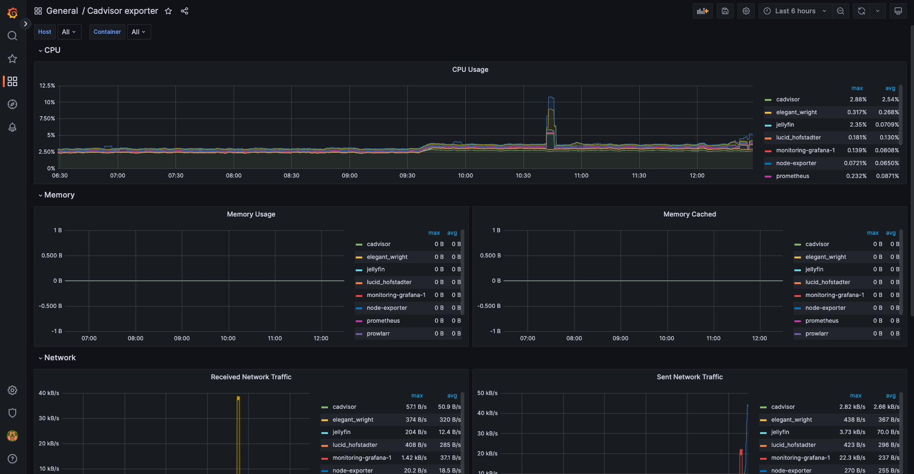

# Server monitoring
This repository contains a docker-compose file which can be used to launch docker containers to monitor CPU, memory, IO, network, & other system metrics. The scripts have been tested & run on Ubuntu 22.04 LTS.

## Prerequisites
Please make sure you have the following programs installed on your machine:
- docker

## Setup
- Run command `./start.sh`
- Open `http://localhost:3000`
- After you are able to access grafana, you will need to import 2 dashboards
    - [Node exporter dashboard](https://grafana.com/grafana/dashboards/1860-node-exporter-full/) : To monitor overall CPU, memory, etc. matrix for the server.
    - [Cadvisor exporter dashboard](https://grafana.com/grafana/dashboards/14282-cadvisor-exporter/) : To monitor CPU, memory, etc. usage for each specific docker container running on the system.
- To import you just need to go to `Dashboard -> Import` in left side menu.

- Then you need to enter `1860` for `Node Exporter dashboard` or `14282` for `Cadvisor dashboard`. You can import both of these one by one.

- On the next screen select the Prometheus data source from dropdown. 

- Click Import

## Where can I access my services?
You may access the services here:

### Grafana
This app will be used to monitor server resource metrics like CPU, memory, etc.

http://localhost:3000

#### Node exporter dashboard

#### Cadvisor dashboard
